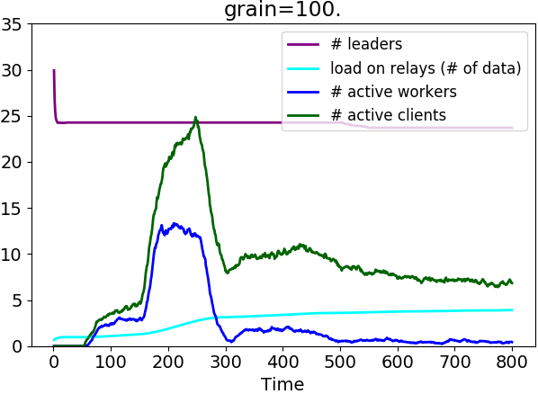
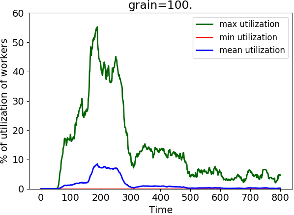
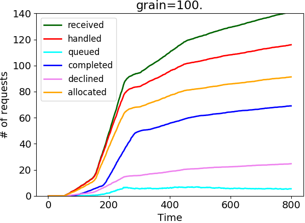
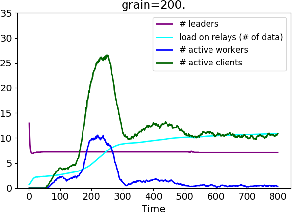
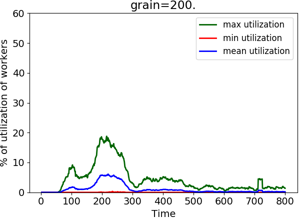
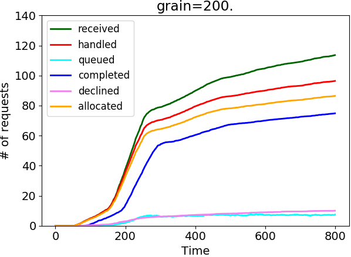

# Coordinating Computation at the Edge: a Decentralized, Self-Organizing, Spatial Approach

## How-to: basics

### Build the project

```commandline
$ ./gradlew
```

It will create a shadow JAR: `build/libs/sim.jar`.

### Launching simulations

Simulations are started through commands like:

```commandline
$ ./gradlew --no-daemon
$ java -Xmx5024m -cp "build/libs/sim.jar" \
  it.unibo.alchemist.Alchemist \
  -b -var <VAR1> <VAR2> ... \
  -y <simulationDescriptor> -e <baseFilepathForDataFiles> \
  -t <simulationDuration> -p <numOfParallelRuns> -v &> log.txt &
```

Simulation descriptors are located under `src/main/yaml`.

### Plotting data

Data can be plotted through command
```commandline
$ ./plotter.py <basedir> <basefilename> <plotGenDescriptor>
```

See `plot.yml` for an example of plot generation descriptor.

#### Put plots into a grid

```commandline
$ montage -tile 2x -geometry +0+0 data/imgs/*.png myimg.png && xdg-open myimg.png
```

## Figures in the paper













### Reproducing the figures

```commandline
$ ./gradlew --no-daemon
$ java -Xmx6024m -cp "build/libs/sim.jar" \
  it.unibo.alchemist.Alchemist \
  -b -var grain random \
  -y src/main/yaml/edgecloud.yml -e data/paper \
  -t 500 -p 6 -v &> exec.txt &
$ ./plotter data paper plot.yml
```

## On the system and simulations

Basic working: clients send requests for services; leaders allocate requests to workers; workers notify completion to leaders, which propagate the event to clients.

Files

* `src/main/yaml/edgecloud.yml`: simulator descriptor
* `src/main/scala/casestudy/EdgeCloudEcosystem.scala`: data model & aggregate program

System

* 50 fog nodes
* 200 worker nodes (working also as 'relays')
* 500 clients

Connectivity (See class `CustomConnectWithinDistance`)

* Fog nodes are fully connected with one another
* The other nodes are connected based on proximity
* However, client nodes are not connected together even when they are close (they only connect to fog nodes or workers/relays).

Notes

* Clients send requests according to parameter `requestProbabilitiesAlongTime`
* Clients can only request one service at a time
* Workers support one or more services (services may be more or less frequent)
* Events are propagated downstream and upstream
* Leaders make allocation decisions based on client profiles, worker profiles, and events. See method `allocate`
  * Requests are rejected if they demand for services which are not supported in the current area (i.e., if no worker in the area has such capability)
  * Requests are queued if the requested service is supported by currently no workers are available
  * Requests are failed if the corresponding worker fails; clients are notified, and may choose to retry it or not

